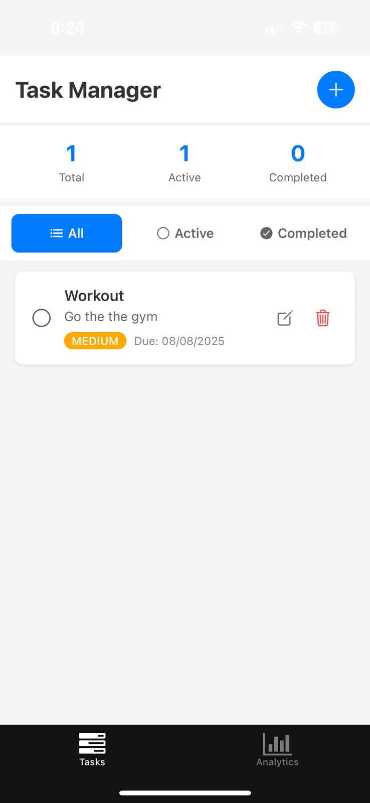

# Task Manager

A simple and efficient task management app built with React Native and Expo.

## Features

- ✅ **Task Management**: Create, edit, and delete tasks with full CRUD operations
- 🎯 **Priority Levels**: Set high, medium, or low priority with color-coded indicators
- 📅 **Due Dates**: Add optional due dates with custom date picker interface
- 📊 **Task Filtering**: Filter tasks by status (All, Active, Completed)
- 💾 **Persistent Storage**: Tasks are saved locally using AsyncStorage
- 📈 **Analytics**: View task statistics, completion rates, and priority breakdown
- 🎨 **Modern UI**: Clean, responsive interface with SafeArea support
- 🔄 **Cross-Platform**: Works seamlessly on iOS, Android, and Web
- ⚡ **Real-time Updates**: Instant task updates and status changes
- 🎛️ **Custom Components**: Custom date picker and form controls

## Getting Started

### Prerequisites

- Node.js (v16 or higher)
- npm or yarn
- Expo CLI

### Installation

1. Clone the repository
2. Navigate to the project directory
3. Install dependencies:
   ```bash
   npm install
   ```

### Running the App

1. Start the development server:
   ```bash
   npm start
   ```

2. Run on your preferred platform:
   - **iOS**: Press `i` in the terminal or scan the QR code with Expo Go
   - **Android**: Press `a` in the terminal or scan the QR code with Expo Go
   - **Web**: Press `w` in the terminal

## Usage

### Adding Tasks
- Tap the "+" button in the top right corner
- Enter task title (required)
- Add optional description
- Set priority level (Low, Medium, High)
- Set optional due date
- Tap "Add Task" to save

### Managing Tasks
- **Complete a task**: Tap the circle next to the task title
- **Edit a task**: Tap the edit icon (pencil) on the task
- **Delete a task**: Tap the trash icon on the task
- **Filter tasks**: Use the filter buttons (All, Active, Completed)

### Analytics
- View task statistics on the Analytics tab
- See completion rates and priority breakdown
- Clear completed tasks in bulk

## Project Structure

```
TaskManager/
├── app/
│   ├── (tabs)/
│   │   ├── index.tsx          # Main task list screen
│   │   ├── explore.tsx        # Analytics screen
│   │   └── _layout.tsx        # Tab navigation
│   └── _layout.tsx            # Root layout with providers
├── components/
│   ├── TaskItem.tsx           # Individual task component
│   ├── TaskForm.tsx           # Add/edit task form
│   ├── DatePickerModal.tsx    # Cross-platform date picker
│   └── SimpleDatePicker.tsx   # Custom date picker interface
├── context/
│   └── TaskContext.tsx        # Task state management with AsyncStorage
└── ...
```

## Technologies Used

- **React Native**: Cross-platform mobile development
- **Expo**: Development platform and tools
- **TypeScript**: Type-safe JavaScript
- **AsyncStorage**: Local data persistence
- **React Context**: State management
- **Expo Vector Icons**: Icon library

## Screenshots

The Task Manager app features a clean, modern interface with intuitive navigation and visual feedback.

### 📱 Main Task List Screen

- **Clean Interface**: Modern header with "Task Manager" title and prominent blue add button
- **Task Statistics**: Real-time counters showing Total, Active, and Completed tasks
- **Smart Filtering**: Easy-to-use filter buttons (All, Active, Completed) with visual selection
- **Task Cards**: Each task displays:
  - Checkbox for quick completion toggle
  - Task title and description
  - Color-coded priority badges (High: Red, Medium: Orange, Low: Green)
  - Due dates in readable format
  - Edit and delete actions with intuitive icons

### 📊 Analytics Dashboard

- **Comprehensive Statistics**: Four key metrics cards showing:
  - Total Tasks count
  - Active Tasks (in progress)
  - Completed Tasks with percentage
  - Overdue Tasks for priority management
- **Priority Breakdown**: Visual priority distribution with color-coded cards
- **Real-time Updates**: Statistics update automatically as tasks change
- **Clean Layout**: Well-spaced cards with clear typography and visual hierarchy

### ✨ Key Visual Features
- **Consistent Design**: Unified color scheme and typography throughout
- **Responsive Layout**: Adapts perfectly to different screen sizes
- **Visual Feedback**: Clear indication of selected states and interactions
- **Modern UI**: Clean cards, proper spacing, and professional appearance
- **Color Coding**: Intuitive priority system with meaningful colors

### 🎯 Working Features Demonstrated
- ✅ Task creation with title "Workout"
- ✅ Priority assignment (Medium priority shown)
- ✅ Due date functionality (08/08/2025)
- ✅ Real-time statistics (1 total, 1 active, 0 completed)
- ✅ Cross-screen navigation between Tasks and Analytics
- ✅ Proper SafeArea handling for modern devices

> **Note**: To add screenshots to your repository, create a `screenshots/` folder in the root directory and add your screen captures as `main-screen.png` and `analytics-screen.png`.

## Live Demo

The app is fully functional and demonstrates:

1. **Task Management**: Create tasks like "Workout" with descriptions
2. **Priority System**: Assign High, Medium, or Low priorities with color coding
3. **Due Dates**: Set future dates (e.g., 08/08/2025) with custom date picker
4. **Real-time Analytics**: Statistics update automatically as you manage tasks
5. **Cross-platform**: Works on iOS, Android, and Web browsers
6. **Persistent Storage**: Tasks are saved locally and persist between sessions

## Known Issues & Solutions

### Date Picker Display
If you experience issues with the date picker:
- The app includes a custom SimpleDatePicker as a fallback
- Works consistently across all platforms
- Provides clear visual feedback for date selection

### Performance Tips
- Tasks are stored locally for instant access
- App uses React Context for efficient state management
- Optimized rendering for large task lists

## Development

### Development Commands
```bash
# Start development server
npm start

# Run on specific platforms
npm run android    # Android emulator
npm run ios        # iOS simulator (Mac only)  
npm run web        # Web browser

# Linting and code quality
npm run lint       # Check code style
```

### Adding New Features
1. Create components in the `components/` directory
2. Add new screens in the `app/(tabs)/` directory
3. Update the TaskContext for state management
4. Test across all platforms

## Contributing

1. Fork the repository
2. Create a feature branch
3. Make your changes
4. Submit a pull request

## License

This project is open source and available under the [MIT License](LICENSE).
